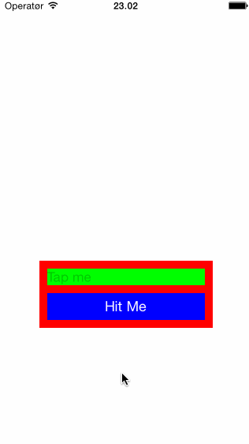

# SHPKeyboardAwareness

SHPKeyboardAwareness lets you know when the keyboard appears and tells you exactly what you need to know about how much the first responder will be overlapped, which view is first responder, keyboard animation curves, duration and much more. 

SHPKeyboardAwareness will not hijack delegate methods of any of your views, it doesn’t subclass or require you to subclass anything. SHPKeyboardAwareness does not require any compromises in your code.

# How it works

When you enable `SHPKeyboardAwareness` you'll be notified every time the keyboard appears, disappears or the first responder changes. `SHPKeyboardAwareness` tracks the first responder and tells you as part of the notification if the view is obstructed by the keyboard. If you prefer, you can also specify a specific view to track instead of the current first responder.

# Example project



See the included example project in the `Example/` folder.

# Usage

`SHPKeyboardAwareness` uses [ReactiveCocoa](https://github.com/ReactiveCocoa/ReactiveCocoa) under the hood. If you're already using Reactive Cocoa, you can receive signals with the keyboard events or alternatively you can use a delegate based approach.

## Reactive Cocoa Signals

To use `SHPKeyboardAwareness` just use one of the two following signals

```Objective-C
- (RACSignal *)shp_keyboardAwarenessSignal
- (RACSignal *)shp_keyboardAwarenessSignalForView:(UIView *)view
```

The signals deliver an instance of `SHPKeyboardEvent` whenever the keyboard appears, disappears or the first responder changes. The event contains information on any conflicting view.

## Delegation

`SHPKeyboardAwareness` is implemented as a category on `NSObject` and is easy to use. To enable `SHPKeyboardAwareness` for a specific object just call:

```Objective-C
[self shp_engageKeyboardAwareness];
```

This will subscribe `self` to any keyboard events.

```
Note that when self deallocates it is automatically unsubscribed from further keyboard events.
```

The first responder (`UITextField` or `UITextView`) will be passed in as part of the notification. To receive the notifications conform to the protocol `SHPKeyboardAwarenessClient` and implement the required method:

```Objective-C
- (void)keyboardTriggeredEvent:(SHPKeyboardEvent *)keyboardEvent
```

## The conflicting view

The `SHPKeyboardEvent` that you receive via the signal or the delegate method contains a reference to any conflicting view in the property

```Objective-C
@property (nonatomic, readonly) UIView *conflictingView;
```

How much the view is obstructed by the keyboard is specified in the property

```Objective-C
@property (nonatomic, readonly) CGFloat requiredViewOffset;
```

and this information can be used to move the view so that it is no longer obstructed.

## Example 1 - ViewController managing a collection view

In this example we subscribe a view controller to notifications for any first responder `UITextField` or `UITextView` that may conflict with the keyboard:

```Objective-C
#import "SHPKeyboardAwareness.h"

@implementation ViewController
...
- (void)viewDidLoad {
    [super viewDidLoad];
    
    // Subscribe to keyboard events. The receiver (self) will be automatically unsubscribed when deallocated
    [self shp_engageKeyboardAwareness];
}

- (void)keyboardTriggeredEvent:(SHPKeyboardEvent *)keyboardEvent {
    
    CGFloat offset = 0;
    switch (keyboardEvent.keyboardEventType) {
        case SHPKeyboardEventTypeShow:
        
            // Keyboard will appear. Calculate the new offset from the provided offset
            offset = collectionView.contentOffset.y - keyboardEvent.requiredViewOffset;
            
            // Save the current view offset into the event to retrieve it later
            keyboardEvent.originalOffset = collectionView.contentOffset.y;
            
            break;
        case SHPKeyboardEventTypeHide:
              
            // Keyboard will hide. Reset view offset to its state before keyboard appeared
            offset = keyboardEvent.originalOffset;
                
            break;
        default:
            break;
    }
        
    // Animate the offset change with the provided curve and duration
    [UIView animateWithDuration:keyboardEvent.keyboardAnimationDuration 
                          delay:0 
                        options:keyboardEvent.keyboardAnimationOptionCurve 
                     animations:^{
        self.collectionView.contentOffset = CGPointMake(collectionView.contentOffset.x, offset);

				self.collectionView.contentInset = UIEdgeInsetsMake(0, 0, event.keyboardFrame.size.height, 0);
        self.collectionView.scrollIndicatorInsets = self.collectionView.contentInset;
    } completion:nil];
}
...
@end
```

In the above example the `SHPKeyboardEvent` tells you:

* What view conflicts with the keyboard (a `UITextField` or `UITextView` instance)
* How much you need to move the view vertically so that it is no longer obstructed by the keyboard (you'll have to move the view yourself)
* The keyboard `frame` and the visible screen `frame`
* The curve and duration of the keyboard animation
* If the keyboard is about to show or hide
  
Furthermore:

* On the event object, you can save the original offset of your view when the keyboard is about to be shown. When it is about to hide, you get the same event object with updated parameters. Retrieve the original offset to reset your view to its previous state.
* All coordinates are normalized with respect to device rotation

## Example 2 - Getting notified when a specific view instance is obstructed

In this example we subscribe to notifications for when a specific view is obstructed by the keyboard. As an example, you may have a container view around the `UITextField` or `UITextView` that you want to keep clear of the keyboard, for instance because the container view contains a `UIButton` that must be fully visible.

```Objective-C
#import "SHPKeyboardAwareness.h"

@implementation ViewController
...
- (void)viewDidLoad {
    [super viewDidLoad];
    
    // Subscribe to keyboard events. The receiver (self) will be automatically unsubscribed when deallocated
    [self engageKeyboardAwarenessForView:_myView];
}

- (void)keyboardTriggeredEvent:(SHPKeyboardEvent *)event {

    // This event fires when and only when any part of the provided view (containerView) conflicts 
    // with the keyboard that is about to appear. Events for other textFields etc are ignored.

    // For the sake of simplicity, we assume the containerFrame's origin.y is 0 when keyboard is not visible
    // But you can use the originalOffset property as shown above to preserve its origin.

    CGRect containerFrame = containerView.frame;
    containerFrame.origin.y += event.requiredViewOffset;
    
    // Animate the offset change with the provided curve and duration
    [UIView animateWithDuration:event.keyboardAnimationDuration 
                          delay:0 
                        options:event.keyboardAnimationOptionCurve 
                     animations:^{
        containerView.frame = containerFrame;
    } completion:nil];
}
...
@end
```

# Contributing

If you find errors or have suggestions for features please create pull requests or open issues specifying your problem / feature request.

We hope you enjoy using `SHPKeyboardAwareness` and that it helps you avoid pesky keyboard obstructions in your apps.
